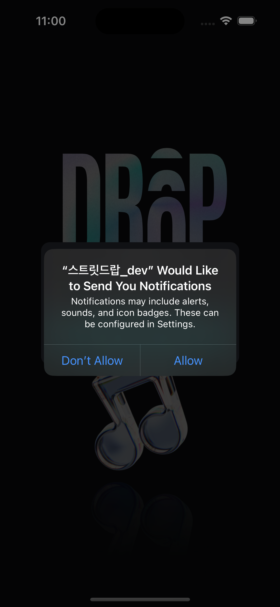

# Street Drop iOS

**Walk in my playlist, Street Drop.**

Street Drop은 지도 위에 음악을 남기고 주변에 공유된 음악을 발견하는 위치 기반 iOS 애플리케이션입니다.



## 주요 기능

- Naver Maps 기반 위치 탐색
- 주변에 드랍된 음악 표시
- 현재 위치에 음악 드랍
- 음악 상세 정보와 플레이어 연동
- 마이페이지와 활동 기록
- push notification 및 deep link 진입

## Stack

- Swift / UIKit
- RxSwift
- SnapKit
- Moya / Alamofire
- Naver Maps SDK
- Firebase
- CocoaPods / Swift Package Manager

## 프로젝트 실행

```bash
cd StreetDrop
pod install
open StreetDrop.xcworkspace
```

CLI 빌드 예시:

```bash
xcodebuild \
  -workspace StreetDrop.xcworkspace \
  -scheme StreetDrop \
  -configuration Debug \
  -destination 'platform=iOS Simulator,name=iPhone 15 Pro' \
  CODE_SIGNING_ALLOWED=NO \
  build
```

지도와 알림 기능을 사용하려면 Naver Maps와 Firebase의 플랫폼별 설정 파일 및 유효한 credential이 필요합니다.
